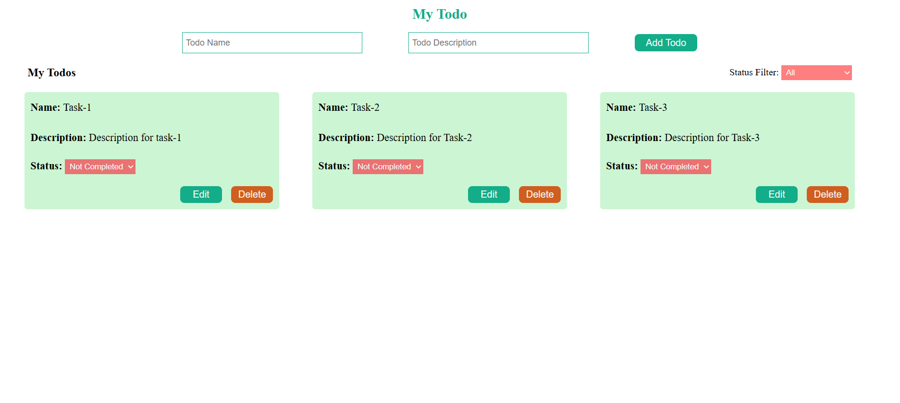
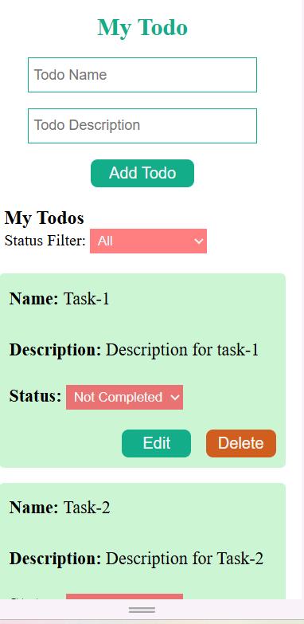

## ✅ todo-app

A simple and interactive React-based Todo Application where users can add, edit, delete, and filter their tasks by status (Completed / Not Completed).

---

## 🚀 Features

- ➕ Add new todos with name and description

- ✏️ Edit existing todos

- ❌ Delete todos

- 🔄 Update todo status (Completed / Not Completed)

- 🔍 Filter todos by status (All, Completed, Not Completed)

- 📱 Responsive design with clean UI

- ♻️ Reusable components (TodoAdd, TodoCard, FilterTodo)

---

## 📂 Project Structure
todo-app/
│── public/                # Static files
│   └── index.html
│
│── src/
│   ├── App.jsx            # Main app logic
│   ├── App.css            # Component-specific styles
│   ├── main.jsx           # React entry point
│   ├── FilterTodo.jsx     # Status filter dropdown
│   ├── TodoAdd.jsx        # Add / Edit todo form
│   ├── TodoCard.jsx       # Individual todo display card
│
│── package.json
│── README.md

---

## 📖 Usage

1. Enter a todo name and description, then click Add Todo.

2. Use the Edit button to modify a task.

3. Use the Delete button to remove a task.

4. Update the status via the dropdown inside each card.

5. Filter todos by status (All, Completed, Not Completed) from the filter bar.

 ---
 
## 📸 Screenshots

💻 Desktop View :



📱 Mobile View:



----

## 📦 Clone & Install

Clone the repository :
```bash
git clone https://github.com/Elanthiran/todo-app.git
cd todo-app
```
---

## Install dependencies
```bash
npm install
```

Start development server
```bash
npm run dev
```
---


## 🛠️ Tech Stack

- React (Vite)

- JavaScript (ES6+)

- CSS3

- HTML5

  ---

## 💡 Future Improvements

- ✅ Persist todos in localStorage

- ✅ Connect to a backend API (Node.js + MongoDB)

- ✅ Add due dates & reminders

- ✅ Implement drag-and-drop reordering

- ✅ Add user authentication to save todos per user

---

## 🤝 Contributing

Contributions are welcome!

- Fork the repository

- Create a new branch (git checkout -b feature/new-feature)

- Commit changes (git commit -m 'Add new feature')

- Push to branch (git push origin feature/new-feature)

- Open a Pull Request

---

## 📜 License

This project is open-source under the MIT License.
